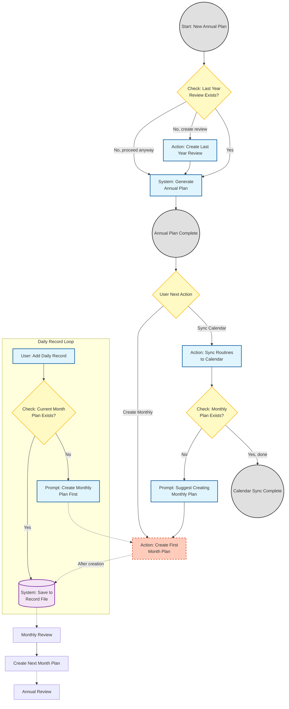

# Life Planner Plugin

[English](README.md) | [中文](README_CN.md)

A personal strategic planning and execution system based on the Life Wheel methodology - Claude Code Plugin.

## Features

- **Annual Review**: Comprehensive annual retrospective with pattern recognition
- **Annual Planning**: Complete annual strategic planning workflow (Phase 0-8)
- **Monthly Review**: Structured monthly retrospectives with rolling adjustments
- **Monthly Planning**: Monthly execution plans aligned with annual goals
- **Life Wheel Assessment**: 8-dimension life balance evaluation
- **Smart Pre-Check**: Automatically suggests review before planning

## Installation

```bash
# 1. add marketplace
/plugin marketplace add charliecai/life-planner

# 2. install plugin
/plugin install life-planner@life-planner-marketplace

# To uninstall
/plugin uninstall life-planner@life-planner-marketplace
```

## Usage

To start the Life Planner, use the slash command:

```
/life-planner
```

This will launch the Life Strategy Advisor and present you with 6 planning options:

1. **Annual Planning** - Create a comprehensive strategic plan for the year
2. **Annual Review** - Review the past year's outcomes
3. **Monthly Planning** - Create specific action plans for a month
4. **Monthly Review** - Review execution for a specific month
5. **Add Daily Record** - Quickly record daily activities
6. **Life Wheel Quick Scan** - Quick assessment of balance across 8 dimensions

### Example

```
User: /life-planner
Assistant: Hello! I'm your Life Strategy Advisor...
           What type of planning would you like to do?
           1. Annual Planning
           2. Annual Review
           ...
```

## Methodology Overview

### Life Wheel - 8 Dimensions

1. **Health** (body, energy, sleep)
2. **Career / Studies**
3. **Wealth / Financial Security**
4. **Family**
5. **Intimate Relationships**
6. **Social / Friends**
7. **Personal Growth** (cognition, skills)
8. **Leisure / Fun / Mental Recovery**

### Core Principles

- **Diagnose structure before discussing goals**
- **Maximum 2-3 battlefields per year**
- **Subtraction before addition**
- **Recovery and input must be protected**
- **All goals must be verifiable**

### Workflow



## Generated Documents

The plugin helps you generate the following documents:

| Document Type | Filename Format | Location |
|--------------|-----------------|----------|
| Annual Plan | `annual-plan-{year}.md` | `{year}/` |
| Annual Review | `annual-review-{year}.md` | `{year}/` |
| Calendar | `routines-{year}.ics` | `{year}/` |
| Monthly Plan | `monthly-plan-{year}-{month}.md` | `{year}/{year}{month}/` |
| Monthly Review | `monthly-review-{year}-{month}.md` | `{year}/{year}{month}/` |
| Daily Records | `daily-records-{year}-{month}.md` | `{year}/{year}{month}/` |

## Project Structure

```
life-planner/
├── .claude-plugin/
│   └── marketplace.json              # Marketplace config
├── plugins/
│   └── life-planner/
│       ├── .claude-plugin/
│       │   └── plugin.json           # Plugin manifest
│       └── skills/
│           └── life-planner/
│               ├── SKILL.md                    # Main skill file
│               ├── ANNUAL-REVIEW-TEMPLATE.md   # Annual review template
│               ├── ANNUAL-PLAN-TEMPLATE.md     # Annual plan template
│               ├── MONTHLY-REVIEW-TEMPLATE.md  # Monthly review template
│               └── MONTHLY-PLAN-TEMPLATE.md    # Monthly plan template
└── README.md
```

## Development

### Local Testing

```bash
# Clone the repo
git clone https://github.com/charliecai/life-planner.git

# Load as plugin
claude --plugin-dir ./life-planner
```

### Validate Plugin

```bash
/plugin validate ./life-planner
```

## License

MIT License

## Credits

This system is based on the "Holographic Life Strategist v2.2" methodology.

