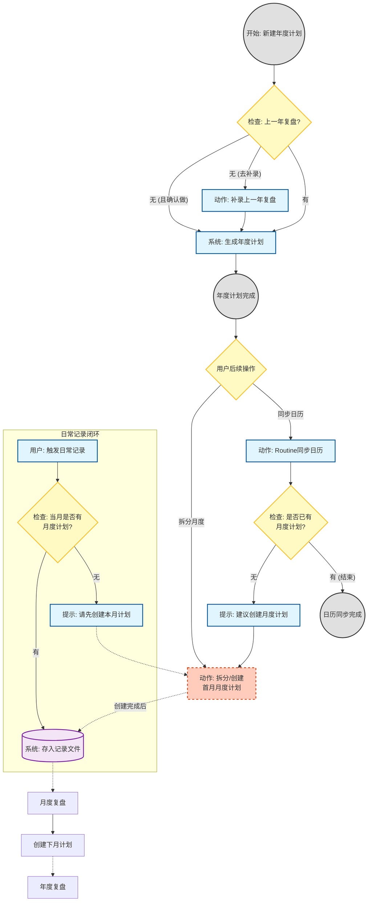

# Life Planner Plugin

[English](README.md) | [中文](README_CN.md)

基于「生命之轮」方法论的个人年度战略规划与执行系统 - Claude Code 插件。

## 功能特性

- **年度规划**：完整的年度战略规划流程（Phase 0-8）
- **月度计划**：对齐年度目标的月度执行计划
- **月度回顾**：结构化的月度复盘与滚动调整
- **生命之轮评估**：8 维度人生平衡扫描

## 安装

```bash
# 1. 添加市场
/plugin marketplace add charliecai/life-planner

# 2. 安装插件
/plugin install life-planner@life-planner-marketplace

# 如果需要卸载
/plugin uninstall life-planner@life-planner-marketplace
```

## 使用方法

安装后，当你在对话中提到以下关键词时，插件会自动触发：

| 触发场景 | 关键词示例 |
|---------|-----------|
| 年度规划 | "年度计划"、"年度规划"、"annual planning" |
| 年度复盘 | "年度复盘"、"年度回顾"、"annual review" |
| 月度计划 | "月度计划"、"月度规划"、"monthly planning" |
| 月度回顾 | "月度复盘"、"月度回顾"、"monthly review" |
| 生命之轮 | "生命之轮"、"人生规划"、"life wheel" |

### 示例对话

```
我想开始做2025年的年度规划
```

```
帮我做一下12月的月度回顾
```

```
制定1月份的月度计划
```

## 方法论概述

### 生命之轮 8 维度

1. **健康**（身体、精力、睡眠）
2. **事业 / 学业**
3. **财富 / 财务安全**
4. **家庭**
5. **亲密关系**
6. **社交 / 朋友圈**
7. **个人成长**（认知、技能）
8. **休闲 / 乐趣 / 心理恢复**

### 核心原则

- **先诊断结构，再谈目标**
- **年度最多 2-3 个主战场**
- **先做减法，再做加法**
- **恢复与输入必须被保护**
- **所有目标必须可验证**

### 工作流程



## 生成的文档

插件会帮你生成以下文档：

| 文档类型 | 文件名格式 | 位置 |
|---------|-----------|------|
| 年度计划 | `annual-plan-{year}.md` | `{year}/` |
| 年度复盘 | `annual-review-{year}.md` | `{year}/` |
| 日历文件 | `routines-{year}.ics` | `{year}/` |
| 月度计划 | `monthly-plan-{year}-{month}.md` | `{year}/{year}{month}/` |
| 月度复盘 | `monthly-review-{year}-{month}.md` | `{year}/{year}{month}/` |
| 每日记录 | `daily-records-{year}-{month}.md` | `{year}/{year}{month}/` |

## 项目结构

```
life-planner/
├── .claude-plugin/
│   └── marketplace.json              # 市场配置
├── plugins/
│   └── life-planner/
│       ├── .claude-plugin/
│       │   └── plugin.json           # 插件清单
│       └── skills/
│           └── life-planner/
│               ├── SKILL.md                    # 主技能文件
│               ├── ANNUAL-PLAN-TEMPLATE.md     # 年度计划模板
│               ├── MONTHLY-PLAN-TEMPLATE.md    # 月度计划模板
│               └── MONTHLY-REVIEW-TEMPLATE.md  # 月度回顾模板
└── README.md
```

## 开发

### 本地测试

```bash
# 克隆项目
git clone https://github.com/charliecai/life-planner.git

# 以插件模式加载
claude --plugin-dir ./life-planner
```

### 验证插件

```bash
/plugin validate ./life-planner
```

## 许可证

MIT License

## 参考资料

本系统基于「全息人生战略官 v2.2」方法论设计。

